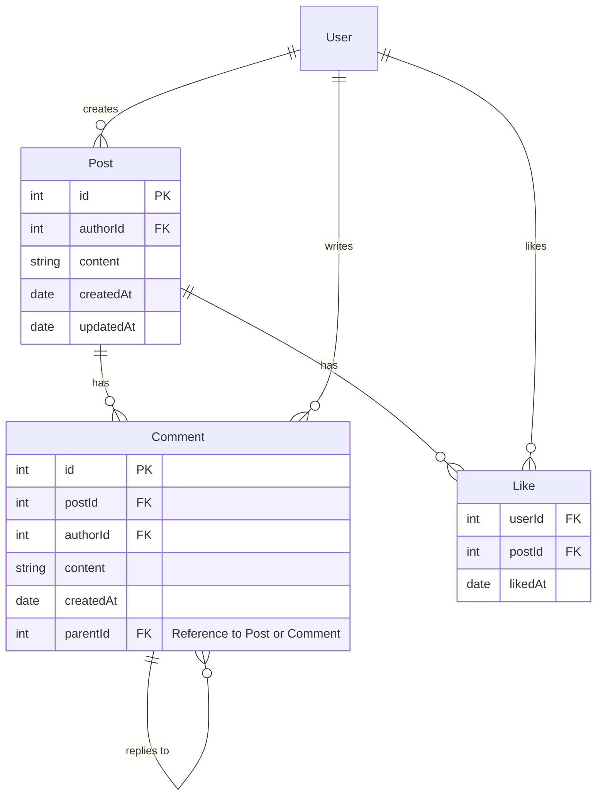

```mermaid
erDiagram
    Post {
        int id PK
        int authorId FK
        string content
        date createdAt
        date updatedAt
    }
    
    Comment {
        int id PK
        int postId FK
        int authorId FK
        string content
        date createdAt
        int parentId FK "Reference to Post or Comment"
    }

    Like {
        int userId FK
        int postId FK
        date likedAt
    }

    User ||--o{ Post : "creates"
    Post ||--o{ Comment : "has"
    Post ||--o{ Like : "has"
    User ||--o{ Comment : "writes"
    User ||--o{ Like : "likes"
    Comment ||--o{ Comment : "replies to"
```