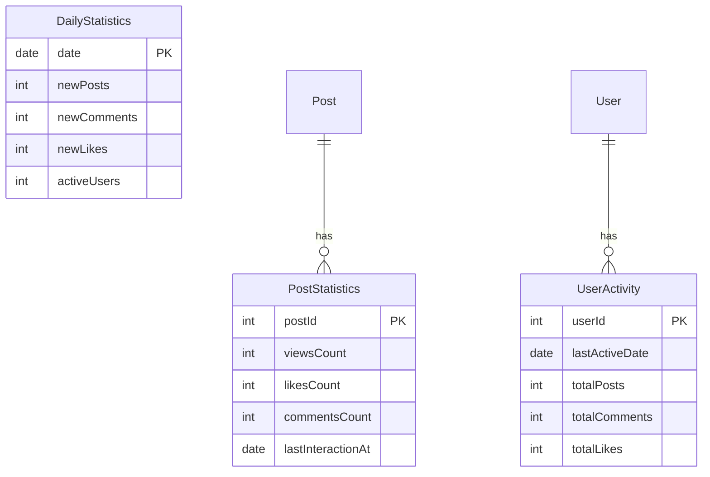

```mermaid
erDiagram
    PostStatistics {
        int postId PK
        int viewsCount
        int likesCount
        int commentsCount
        date lastInteractionAt
    }

    UserActivity {
        int userId PK
        date lastActiveDate
        int totalPosts
        int totalComments
        int totalLikes
    }

    DailyStatistics {
        date date PK
        int newPosts
        int newComments
        int newLikes
        int activeUsers
    }

    Post ||--o{ PostStatistics : "has"
    User ||--o{ UserActivity : "has"

```