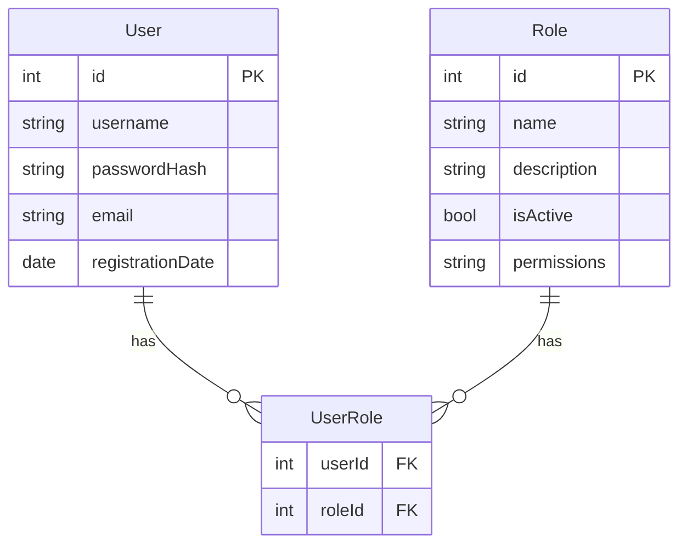

```mermaid
erDiagram
    User {
        int id PK
        string username
        string passwordHash
        string email
        date registrationDate
    }
    
    Role {
        int id PK
        string name
        string description
        bool isActive
        string permissions
    }

    UserRole {
        int userId FK
        int roleId FK
    }

    User ||--o{ UserRole : "has"
    Role ||--o{ UserRole : "has"

```